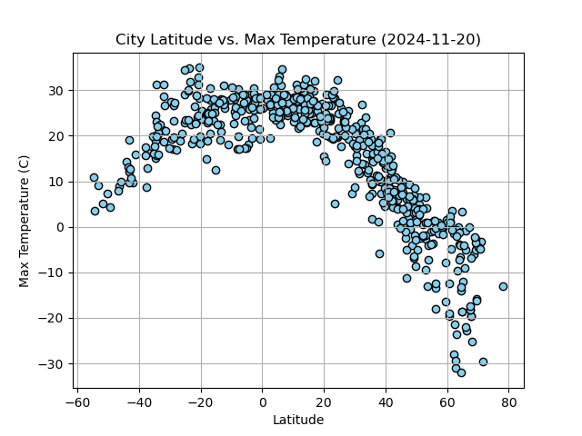
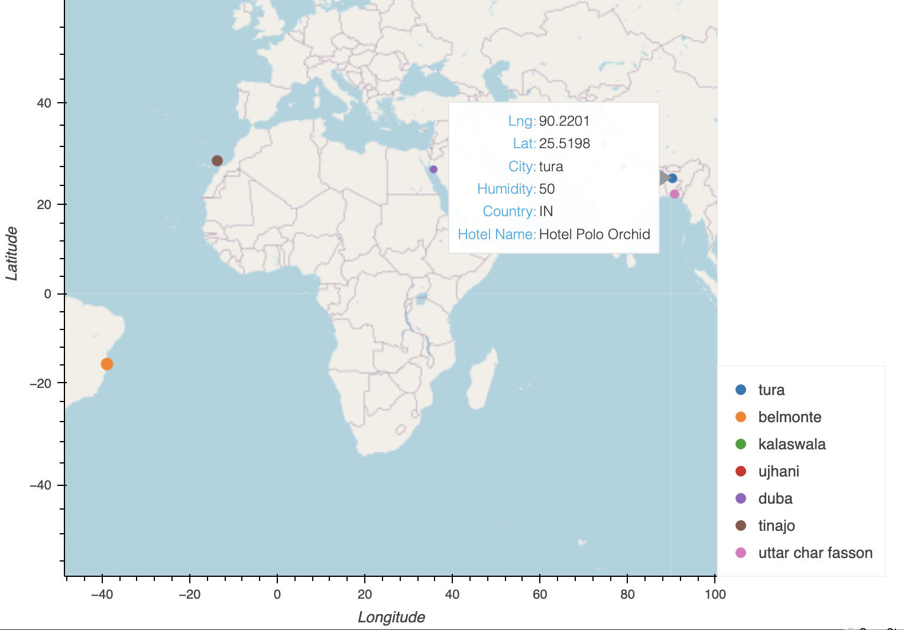

# python-api-challenge
WeatherPy and VacationPy - API Data Retrieval and Visualisation


## Contents

1. [Overview](#1-overview)
2. [Repository](#2-repository)
3. [Deployment](#3-deployment)
4. [Data Analysis](#4-data-analysis)
5. [References](#5-references)

## 1. Overview

This challenge explores global weather patterns and demonstrates how weather data can guide vacation planning. Using Python, the analysis examines the relationship between latitude and weather variables like temperature, humidity, cloudiness, and wind speed. Skills applied include data retrieval through APIs (OpenWeatherMap and Geoapify), data cleaning and manipulation using pandas, and statistical analysis with linear regression. The results are visualised through scatter plots, regression charts, and interactive maps created with Matplotlib and hvPlot. This challenge highlights the use of programming, API integration, and data visualisation to extract meaningful insights from real-world weather data.

## 2. Repository

This repository contains the following files and directories:

### Jupyter Notebooks
- [`weather_vacation_py/weather_py.ipynb`](weather_vacation_py/weather_py.ipynb): This notebook performs the data analysis for Part 1 of this challenge. It retrieves weather data from over 500 cities and creates plots showcasing the relationship between latitude and various weather variables.
- [`weather_vacation_py/vacation_py.ipynb`](weather_vacation_py/vacation_py.ipynb): This notebook plans future vacations based on ideal weather conditions and uses the Geoapify API to find hotels within specific cities.

### Output Files from `weather_py.ipynb`
- [`weather_vacation_py/output_data/fig1.png`](weather_vacation_py/output_data/fig1.png)
- [`weather_vacation_py/output_data/fig2.png`](weather_vacation_py/output_data/fig2.png)
- [`weather_vacation_py/output_data/fig3.png`](weather_vacation_py/output_data/fig3.png)
- [`weather_vacation_py/output_data/fig4.png`](weather_vacation_py/output_data/fig4.png)

### Output Files from `vacation_py.ipynb`
- `weather_vacation_py/output_data/cities.csv`
- [`weather_vacation_py/output_data/humidity_map.png`](weather_vacation_py/output_data/humidity_map.png)
- `weather_vacation_py/output_data/humidity_map.html`
- [`weather_vacation_py/output_data/hotel_map.png`](weather_vacation_py/output_data/hotel_map.png)
- `weather_vacation_py/output_data/hotel_map.html`

### `.gitignore`
- Prevents the upload of sensitive information such as API keys and other unwanted files to the online repository.

## 3. Deployment

To deploy and run this challenge, follow these steps:

1. **Clone the repository**:
   Download or clone this repository to your local machine.

2. **Install required Python libraries**:
   Ensure that the following Python libraries are installed: `pandas`, `requests`, `matplotlib`, `numpy`, `scipy`, `citipy`, and `hvplot`.

3. **API Keys**:
   Obtain your API keys for the OpenWeatherMap and Geoapify APIs:
   - [OpenWeatherMap API](https://openweathermap.org/api)
   - [Geoapify API](https://www.geoapify.com)

   Save the keys in `weather_vacation_py/api_keys.py`:

   ```
   # OpenWeatherMap API Key
   weather_api_key = "insert-your-key-here"
   # Geoapify API Key
   geoapify_key = "insert-your-key-here"
   ```

4. **Run the notebooks**:
   - Open [`weather_vacation_py/weather_py.ipynb`](weather_vacation_py/weather_py.ipynb) to perform the weather analysis and generate visual plots.
   - Open [`weather_vacation_py/vacation_py.ipynb`](weather_vacation_py/vacation_py.ipynb) to visualise ideal vacation locations and find hotels.

## 4. Data Analysis

This challenge answers the following questions:
- How does the weather (temperature, humidity, cloudiness, and wind speed) relate to latitude?
- What is the linear regression model between weather variables and latitude for cities in the Northern and Southern Hemispheres?
- Which cities have ideal weather conditions for a vacation, such as moderate temperatures and low humidity?
- Where are the nearest hotels to these cities located?

### Weather Analysis:
- Latitude vs. Temperature
- Latitude vs. Humidity
- Latitude vs. Cloudiness
- Latitude vs. Wind Speed



### Vacation Planning:
- Creates a map with city points based on weather data.
- Narrows down cities with ideal weather conditions (e.g., temperatures between 21°C and 27°C, low wind speed, and zero cloudiness).
- Finds hotels near the cities using the Geoapify API.



## 5. References

- [OpenWeatherMap API](https://openweathermap.org/api)
- [Geoapify API](https://www.geoapify.com)
- `hvPlot` Python Library: [https://hvplot.holoviz.org/](https://hvplot.holoviz.org/)
- `citipy` Python Library: [https://pypi.python.org/pypi/citipy](https://pypi.python.org/pypi/citipy)
